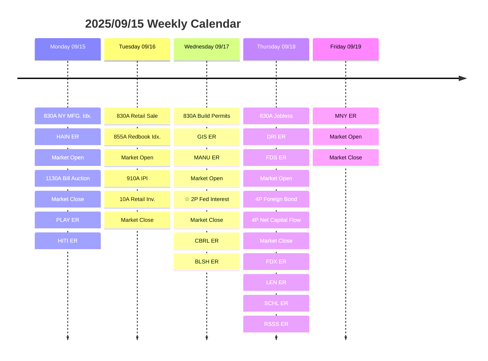

# Weekly Foresee 2025/09/15

## Calendar

## Thesis

The most anticipated event this week will be the Fed's decision on the interest. There should be a HUGE impact on the market on Wednesday afternoon. However, I assume part of the interest cut, if not all of them, has been priced in.

| Sector | Weekly Return (%) | WeekLy Change | YTD Return (%) |
|---|---:|---:|---:|
| S&P 500 |             1.57 |         1.23 |          11.06 |
| Consumer Discretionary |             1.50 |         0.04 |           5.64 |
| Consumer Staples |            -0.68 |        -0.79 |           2.54 |
| Energy |             1.42 |         4.77 |           1.29 |
| Financials |             1.38 |         3.08 |          10.72 |
| Health Care |             0.15 |        -0.19 |          -0.61 |
| Industrials |             0.43 |         1.14 |          14.21 |
| Materials |            -0.30 |         0.04 |          10.21 |
| Technology |             3.05 |         2.89 |          14.90 |
| Communication Services |             2.32 |        -0.64 |          19.89 |
| Real Estate |             0.40 |         0.71 |           3.70 |
| Utilities |             2.43 |         3.44 |          10.92 |

## Industry Study: HVAC Industry

HVAC stands for Heating, Ventilation, and Air Conditioning. It's widely used in the U.S. apartments and houses.

### $5000 rule

The %5,000 rule is an industry accepted guideline that halps homeowners make a financial decision about their HVAC system. First, multiply the age of your system by the repair cost. if the outcome is over $5,000, you should probably replace