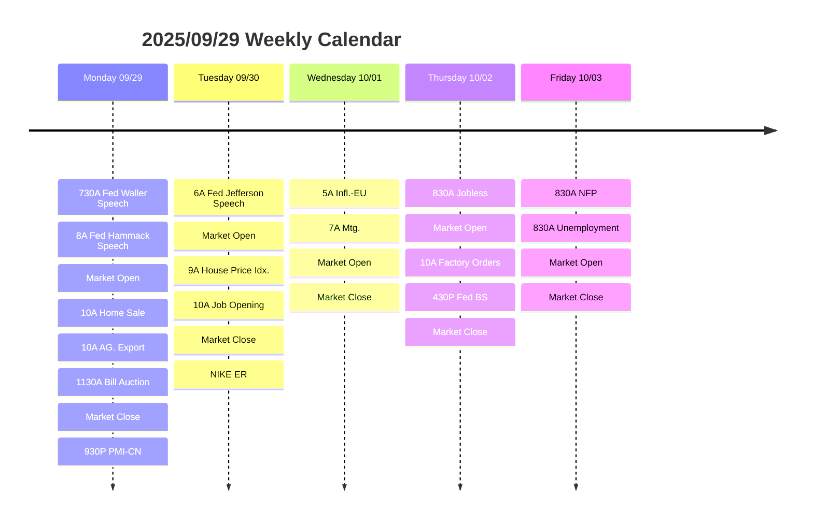
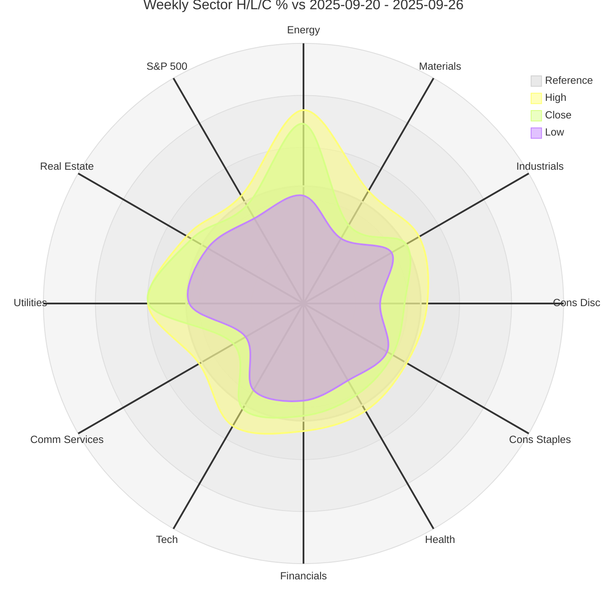

# Weekly Foresee 2025/09/29

## Calendar

## Recap Last Week

## Federal Governors and their speech

The Fed we normally refer to is the "Federal Reserve System", which oversees the 12 Federal Reserve Banks.
| District Number | Letter | Federal Reserve Bank | Branches                                                                                   | Website                          | President           |
|-----------------|--------|----------------------|--------------------------------------------------------------------------------------------|----------------------------------|---------------------|
| 1               | A      | Boston               |                                                                                            | https://www.bostonfed.org        | Susan M. Collins    |
| 2               | B      | New York City        |                                                                                            | http://www.newyorkfed.org        | John C. Williams    |
| 3               | C      | Philadelphia         |                                                                                            | http://www.philadelphiafed.org   | Patrick T. Harker   |
| 4               | D      | Cleveland            | Cincinnati, Ohio;Pittsburgh, Pennsylvania                                               | http://www.clevelandfed.org      | Beth M. Hammack     |
| 5               | E      | Richmond             | Baltimore, Maryland;Charlotte, North Carolina                                           | http://www.richmondfed.org       | Thomas Barkin       |
| 6               | F      | Atlanta              | Birmingham, Alabama;Jacksonville, Florida;Miami, Florida;Nashville, Tennessee;New Orleans, Louisiana | http://www.atlantafed.org/       | Raphael Bostic      |
| 7               | G      | Chicago              | Detroit, Michigan                                                                          | http://www.chicagofed.org        | Austan Goolsbee     |
| 8               | H      | St. Louis            | Little Rock, Arkansas;Louisville, Kentucky;Memphis, Tennessee                        | http://www.stlouisfed.org        | James B. Bullard    |
| 9               | I      | Minneapolis          | Helena, Montana                                                                            | https://www.minneapolisfed.org   | Neel Kashkari       |
| 10              | J      | Kansas City          | Denver, Colorado;Oklahoma City, Oklahoma;Omaha, Nebraska                             | http://www.kansascityfed.org     | Jeffrey Schmid      |
| 11              | K      | Dallas               | El Paso, Texas;Houston, Texas;San Antonio, Texas                                     | http://www.dallasfed.org         | Lorie K. Logan      |
| 12              | L      | San Francisco        | Los Angeles, California;Portland, Oregon;Salt Lake City, Utah;Seattle, Washington | http://www.frbsf.org             | Mary C. Daly        |

The Fed governors boards are selected from the district Fed banks. The current Fed Board of Governors consists of 7 people. Among them, Jerome Powell is the chair, comming from the Philadelphia Fed, with most spotlights were on him. 
Other members may deliver their speech on various of events, such as this week, Christopher Waller, the Fed Board Governor, a Republician, will give a speech in SIBOS 2025 conference, titled [View from the top with Christopher Waller](https://www.sibos.com/programme/conference). The conference is organized by Swift system on various financial activities.

Sometimes, the Prescident of district Fed banks' speech may give echnomic significance as well. For example .the Cleveland Fed President Beth Hammack will give speech Monday on [Inflation: Drivers and Dynamics 2025 Conference](https://www.ecb.europa.eu/press/conferences/html/20250929_inflation_conference.en.html) hosted by the European Central Bank.

