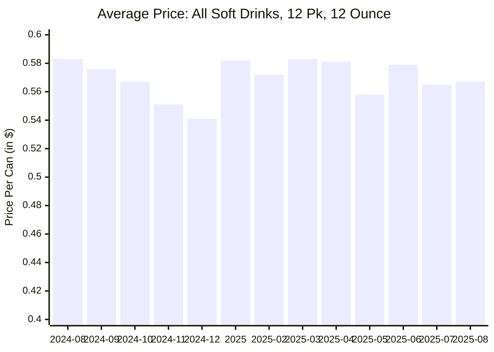
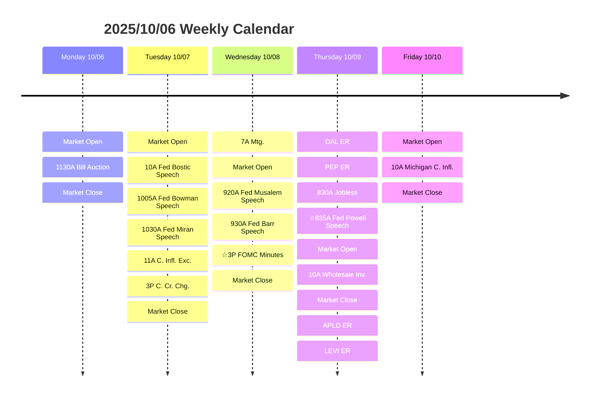

# Weekly Foresee 2025/10/06

The government shutdown was the dominant development last week. Despite the disruption, the stock market rose, as it often does after such events. Looking toward next week, there is no guarantee the government will reopen, though optimistic signals from the White House have reduced near‑term downside risk.

Several Fed officials, both national and regional, are scheduled to speak next week, and markets are increasingly pricing in the possibility of future rate cuts. Overall, I expect the market to continue rising, but with a cautious tone.

The S&P 500 ended the week higher. Utilities, technology, and health-care outperformed, while Communication Services and Energy lagged. Real Estate was essentially flat. Technology remains a relative strength; health-care has recovered from recent weakness; and utilities were supported by strong data‑center demand.

The earnings to watch are Delta Air Lines (DAL) and PepsiCo (PEP). 

## Watch: DEL, PEP, APLD, TSLA
### Delta Air Lines
Delta has recovered since the April 7 shock (≈ +35% over six months), but international travel has softened recently (≈ −9% over one month). While leisure travel to destinations like Las Vegas has picked up, long‑term growth may be constrained.

During the government shutdown, TSA staff and air‑traffic controllers have been working without pay. Last Friday there was an incident at LaGuardia Airport in New York involving two Delta aircraft on a taxiway. Combined with fewer sponsored events and other short‑term disruptions, passenger volumes could decline in the near term.

I prefer a short bias on DAL. At the time of writing, the stock was about $57.80.

Below are current prices for 5‑DTE options:

| Call Cost | Target Price | Put Cost |
| 3.55      | 55           | 1.16     |
| 2.87      | 56           | 1.54     |
| 2.29      | 57           | 2.01     |
| 1.83      | 58           | 2.53     |
| 1.42      | 59           | 3.15     |
| 1.13      | 60           | 3.80     |

Last week's low was 55.8. My plan: try to buy four $55 puts at $1.00 or less, sell two if they double before the earnings release, and close the remaining two immediately after the release regardless of outcome. For hedging, consider buying a $56 call only if it can be obtained for $1.00 or less. American Airline (AAL) calls will be also considered.


### PepsiCo
PepsiCo rallied about 6% on July 17 after beating Q2 estimates. However, Q2 operating margin declined to 11.44% (from 13.93% in Q1 and 13.54% a year earlier). With restaurant traffic down (≈ −0.97% over six months) while the S&P 500 has risen materially, on‑premise consumption and demand for fountain syrup could be under pressure.

Cost inputs are rising — notably utilities and corn — and potential import/tariff pressures could further compress margins. At the same time, consumer prices for soft drinks have trended lower recently (source: [FRED](https://fred.stlouisfed.org/series/APU0000FN1102))



A put looks attractive — PepsiCo is trading near $142.

| Call Cost | Target Price | Put Cost |
| 13.8 | 130 | 0.39 |
| 12.45 | 131| 0.45 |
| 10.7 | 132 | 0.53 |
| 9.85 | 133 | 0.62 |
| 8.5 | 134 | 0.82 |
| 8.05 | 135 | 0.90 |
| 7.25 | 136 | 1.08 |
| 6.45 | 137 | 1.29 |
| 5.7 | 138 | 1.56 |
| 5 | 139 | 1.86 |
| 4.4 | 140 | 2.26 |
| 3.8 | 141 | 2.85 |
| 3.25 | 142 | 3.15 |

Buying two $133 puts near $0.50 would be a reasonable trade; no hedge is planned for this position.

### Applied Digital Corporation

The company surged last Thursday after announcing a lease agreement with a data‑center/AI infrastructure partner. This rally appears driven more by speculative interest in AI and data‑center demand than by an earnings catalyst, so the setup is short‑term and momentum‑driven.

Plan: size conservatively and use strict stops. Target a small call position — for example, 2 contracts of the $30 call if it can be bought near $0.70 — with selling first one at 100% as cost securing, second one can fly free.

| Call Cost | Target Price | Put Cost |
| 1.5 | 30 | 5.35 |
| 3.35 | 25 | 1.87 |

### Tesla
Tesla has been in a downtrend since Oct 1. The uplift from tax‑credit driven demand appears largely priced in, and the stock weakened late last week. TSLA is highly time‑sensitive and volatile; position sizing and disciplined exits matter.

Last week I took a $200 loss on a TSLA put that would have been a ~ $300 gain had I followed my plan—avoid holding out for more and stick to pre‑defined exits. TSLA trades near $429 at the time of writing.

Example option quotes:

| Call Cost | Target Price | Put Cost |
| 25.00     | 410          | 5.10     |
| 21.80     | 415          | 6.45     |
| 3.85      | 460          | 33.75    |

Plan: target a $410 put around $3.00 and consider a $460 call near $1.00 as a hedge only if sizing and price are favorable. Trade with strict risk limits—this is a fast, pump‑and‑dump–like setup.

## Calendar



```mermaid
---
title: "Weekly Sector H/L/C % vs 2025-09-28 - 2025-10-03"
config:
  themeVariables:
    cScale0: "#D3D3D3"
---
radar-beta
  axis GSPE['Energy']
  axis SP50015['Materials']
  axis SP50020['Industrials']
  axis SP50025['Cons Disc']
  axis SP50030['Cons Staples']
  axis SP50035['Health']
  axis SP50040['Financials']
  axis SP50045['Tech']
  axis SP50050['Comm Services']
  axis SP50055['Utilities']
  axis SP50060['Real Estate']
  axis SPX['S&P 500']
  curve ref['Reference']{100.00,100.00,100.00,100.00,100.00,100.00,100.00,100.00,100.00,100.00,100.00,100.00}
  curve l['Low']{95.95, 99.45, 99.97, 98.67, 99.39, 99.43, 98.51, 100.25, 97.41, 99.26, 99.34, 99.96}
  curve c['Close']{96.65, 101.06, 101.17, 99.19, 99.57, 106.82, 99.74, 102.25, 97.90, 102.39, 100.21, 101.09}
  curve h['High']{99.36, 101.51, 101.83, 101.14, 100.60, 107.81, 100.69, 103.17, 101.05, 103.33, 100.98, 101.61}
  max 112.81
  min 90.95
  ```