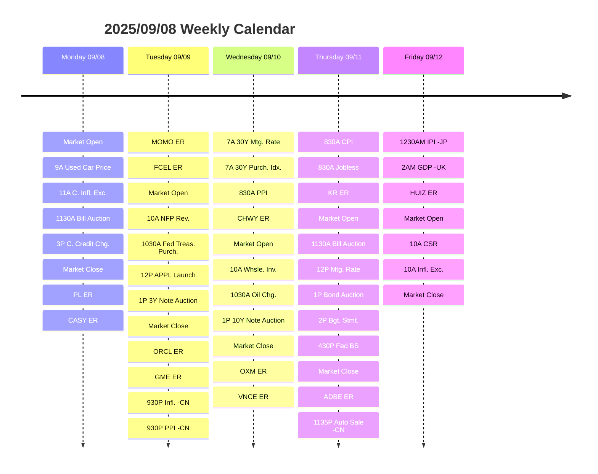

# Weekly Forsee 2025/09/08

## Calendar

## Thesis

This week's market sentiment is likely to be dominated by the anticipation of a potential Fed interest rate cut, with key economic data points providing crucial clues for investors ahead of the September 17 FOMC meeting. Last Friday's disappointing jobs report, with a weaker-than-expected nonfarm payroll number, solidified market expectations for a September rate cut. This initial negative sentiment was quickly offset by the renewed hope that a looser monetary policy would stimulate the economy, leading to a swift market reversal.
As you've noted, a rate cut is particularly beneficial for small businesses by easing the burden of debt. This dynamic extends to various market sectors. Financials and Real Estate, for example, are highly sensitive to interest rates and may face continued pressure as a rate cut squeezes their profit margins on loans. However, the prospect of lower mortgage rates could eventually stimulate the housing market, potentially benefiting Real Estate in the long term. Conversely, sectors like Consumer Discretionary could see a boost as consumers have more disposable income and access to cheaper credit for big-ticket purchases.

If we recap last week, e

| Sector              | Weekly Return (%) | YTD Return (%) |
|---------------------|-------------------|---|
| Comm. Serv.         | 5.1               | 23.9 |
| Consumer Discr.     | 1.7               | 3.7 |
| Consumer Staples    | 0.4               | 6.0 |
| Health Care         | 0.4               | 1.2 |
| S&P 500             | 0.4               | 11.2 |
| Technology          | 0.2               | 14.3 | 
| Materials           | -0.2              | 11.4 |
| Real Estate         | -0.3              | 5.3 |
| Industrials         | -0.7              | 15.3 |
| Utilities           | -1.0              | 11.9 |
| Financials          | -1.7              | 10.7 |
| Energy              | -3.5              | 3.8 |

## Convension
The calendar listed a selected list of events that could contribute to the investment decisions this week.

I include two types of events in the list:
- Earning Report (ER)
- Data Release (DR)

All the time is in ET, which is UTC-4 for this week. For improved readibility, the clock time is represented in a way that A for A.M., P for P.M.

Unless explicitly specified, the event will be for the U.S. economy. For event outside of the U.S. Economy, they will have format `<time>-<evnent>-<localtion>`.

## Abbreviation table

| Abbreviation | Word | Scope |
| ------------ | ---- | ----- |
| C. | Consumer | Global |
| CPI | Consumer Price Index | Global |
| Exc. | Expection | Global |
| Infl. | Inflation | Global |
| Cr. | Credit | Global |
| Chg. | Change | Global |
| NFP | Nonfarm Payroll | Global |
| PR | Payroll | Global |
| Rev. | Revision | Global |
| Treas. | Treasury | Global |
| Purch. | Purchase | Global |
| Mtg. | Mortgage | Global |
| Idx. | Index | Global |
| Whsle. | Wholesale | Global |
| Inv. | Inventory | Global |
| Bdt. | Budget | Global |
| Stmt. | Statement | Global |
| BS | Balance Sheet | Global |
| IPI | Industrial Production Idnex | Global |
| CSI | Consumer Sentiment Index | Global |
